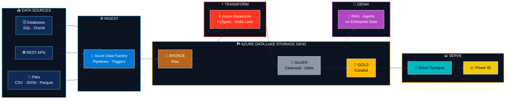

<!-- ==================== HEADER BANNER ==================== -->

  

  

<!-- ==================== CERTIFICATION BADGES ==================== -->

  
  
  

  
  
  
  

---

<!-- ==================== ABOUT ==================== -->
<table>
<tr>
<td width="60%" valign="top">

## 👨‍💻 Professional Summary

I'm **M Reddappa Yadav**, an **Azure Data Engineer with 4+ years of experience** building cloud-based data solutions, currently at **EY GDS, Bangalore**.

I design reliable data platforms that move data from **source ➜ lake ➜ transformation ➜ analytics**, with a focus on pipelines that are **scalable, observable, and cost-aware**.

🔹 `Data Engineering` · `Lakehouse` · `ETL/ELT` · `Distributed Processing`

🚀 I'm also expanding into **Generative AI and Agentic AI**, particularly where AI can work with **enterprise data**.

</td>
<td width="40%" valign="top">

### ⚡ Profile Snapshot

| | |
|---|---|
| 🎯 **Role** | `Azure Data Engineer` |
| ⏳ **Experience** | `4+ Years` |
| ☁️ **Cloud** | `Microsoft Azure` |
| 🏗️ **Data** | `Big Data / Lakehouse` |
| ⚙️ **Processing** | `PySpark / Spark` |
| 🤖 **AI** | `GenAI / RAG / Agents` |
| 🏆 **Certified** | `AZ-104 · DP-900 · AI-900` |

</td>
</tr>
</table>

---

<!-- ==================== AZURE ARCHITECTURE ==================== -->
## ☁️ Azure Data Platform I Build

  
  
  
  

---

<!-- ==================== TECH STACK ==================== -->
## 🛠️ Azure Tech Stack

<table>
<tr>
<td width="25%" align="center"><h4>🔄 Ingestion & Orchestration</h4></td>
<td>
  
  
  
</td>
</tr>
<tr>
<td align="center"><h4>🏞️ Storage & Lakehouse</h4></td>
<td>
  
  
  
</td>
</tr>
<tr>
<td align="center"><h4>⚡ Processing</h4></td>
<td>
  
  
  
  
</td>
</tr>
<tr>
<td align="center"><h4>📊 Analytics & Serving</h4></td>
<td>
  
  
</td>
</tr>
<tr>
<td align="center"><h4>🔐 Cloud Administration</h4></td>
<td>
  
  
  
</td>
</tr>
<tr>
<td align="center"><h4>🤖 Generative AI</h4></td>
<td>
  
  
  
</td>
</tr>
<tr>
<td align="center"><h4>🧰 Dev Tools</h4></td>
<td>
  
  
</td>
</tr>
</table>

---

<!-- ==================== EXPERIENCE ==================== -->
## 💼 Professional Journey

| 📅 Period | 🏢 Company | 🎯 Role | ☁️ Focus |
|:---|:---|:---|:---|
| **Apr 2026 ➜ Present** | **EY GDS**, Bangalore | Azure Data Engineer | Enterprise data platforms on Azure |
| **Jul 2023 ➜ Apr 2026** | **CGI** | Software Engineer, Azure Data Engineering | ADF · Databricks · PySpark · Delta Lake |
| **Jul 2022 ➜ Jun 2023** | **CGI** | Associate Software Engineer, Azure Cloud Administration | Azure administration and operations |

  
  

---

<!-- ==================== PRINCIPLES ==================== -->
## 🎯 What I Bring to a Team

<table>
<tr>
<td align="center" width="25%">🔐 <b>Reliability</b> Idempotent, restartable pipelines with clear failure handling</td>
<td align="center" width="25%">⚡ <b>Performance</b> Partitioning and optimized Spark jobs</td>
<td align="center" width="25%">🧪 <b>Quality</b> Validation and data-quality checks at every
