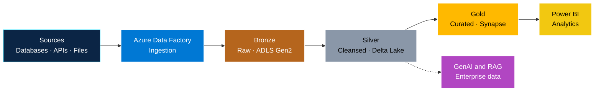

<!-- ==================== BANNER ==================== -->

  

  
  
  

<!-- ==================== PHOTO + ABOUT ==================== -->
<table>
<tr>
<td width="230" align="center" valign="top">

 

**M Reddappa Yadav** 
Azure Data Engineer 
EY GDS, Bangalore

</td>
<td valign="top">

### About

I'm an **Azure Data Engineer with 4+ years of experience**, currently at **EY GDS**. I build data platforms that move data from source to lake to analytics, and I care about pipelines that are **reliable, observable and cost-aware**.

My day-to-day stack is **Azure Data Factory, Azure Databricks, PySpark, Delta Lake and Synapse**. I'm also exploring **Generative AI and Agentic AI**, especially where AI can work with enterprise data.

</td>
</tr>
</table>

---

## Azure data platform I work with

Transformations between layers run on **Azure Databricks (PySpark and Delta Lake)**, with idempotent pipelines, incremental loads and data quality checks at every layer.

---

## Skills

| Area | Technologies |
|:--|:--|
| **Ingestion and orchestration** |  |
| **Storage and lakehouse** |   |
| **Processing** |     |
| **Analytics and serving** |   |
| **Cloud administration** |  |
| **Applied AI** |    |
| **Version control** |   |

---

## Currently

- Building production-grade lakehouse pipelines on Azure
- Deepening Spark performance tuning and data governance
- Exploring GenAI, RAG and Agentic AI on enterprise data

  
  

