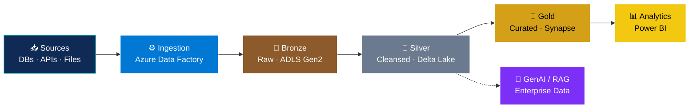

<!-- ==================== HEADER BANNER ==================== -->

  

  

<!-- ==================== CERTIFICATION BADGES ==================== -->

  
  
  

  
  
  
  

---

<!-- ==================== ABOUT ==================== -->
<table>
<tr>
<td width="60%" valign="top">

## 👨‍💻 Professional Summary

I'm **M Reddappa Yadav**, an **Azure Data Engineer with 4+ years of experience** building cloud-based data solutions, currently at **EY GDS, Bangalore**.

I design reliable data platforms that move data from **source → lake → transformation → analytics**, with a focus on pipelines that are **scalable, observable, and cost-aware**.

🔹 `Data Engineering` · `Lakehouse` · `ETL/ELT` · `Distributed Processing`

🚀 I'm also expanding into **Generative AI and Agentic AI**, particularly where AI can work with **enterprise data**.

</td>
<td width="40%" valign="top">

### ⚡ Profile Snapshot

| | |
|---|---|
| 🎯 **Role** | `Azure Data Engineer` |
| ⏳ **Experience** | `4+ Years` |
| ☁️ **Cloud** | `Microsoft Azure` |
| 🏗️ **Data** | `Big Data / Lakehouse` |
| ⚙️ **Processing** | `PySpark / Spark` |
| 🤖 **AI** | `GenAI / RAG / Agents` |
| 🏆 **Certified** | `AZ-104 · DP-900 · AI-900` |

</td>
</tr>
</table>

---

<!-- ==================== TECH STACK ==================== -->
## 🛠️ Tech Stack

  
  
  
  
  
  
  
  
  
  
  

---

<!-- ==================== ARCHITECTURE ==================== -->
## 🏗️ How I Think About Data Platforms

### 🎯 My Engineering Principles

| 🔐 Reliability | ⚡ Performance | 🧪 Quality | 💰 Efficiency |
|:---:|:---:|:---:|:---:|
| Idempotent, restartable pipelines | Partitioning & optimized Spark jobs | Validation & data-quality checks | Right-sized compute & storage |

---

<!-- ==================== CURRENTLY ==================== -->
## 🌱 Currently Focused On

- 🔭 Building production-grade **lakehouse pipelines** on Azure
- 🤖 Exploring **GenAI, RAG, and Agentic AI** on enterprise data
- 📈 Deepening **Spark performance tuning** and **data governance**
- 💬 Ask me about: `Azure Data Factory` · `Databricks` · `PySpark` · `Delta Lake` · `Synapse`

---

<!-- ==================== GITHUB STATS ==================== -->
## 📊 GitHub Stats

  
  

  

---

<!-- ==================== CONNECT ==================== -->
## 🤝 Connect With Me

  
  

  <i>"Good data engineering is invisible: pipelines just work, and insights arrive on time."</i>

<!-- ==================== FOOTER ==================== -->

  

